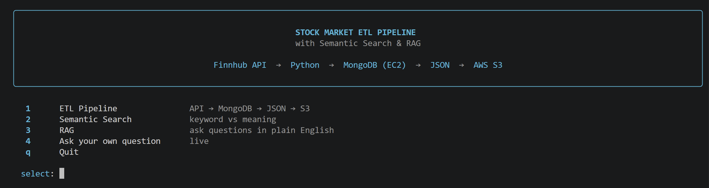
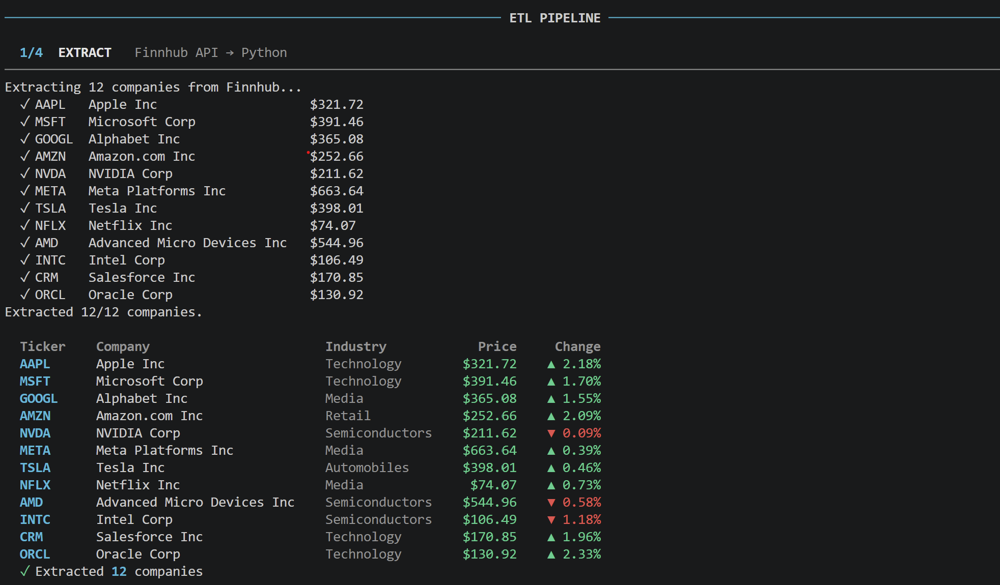
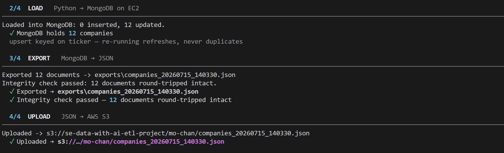
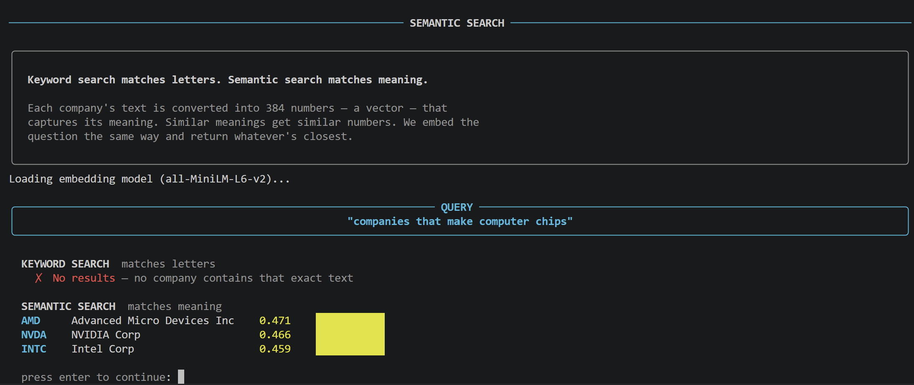
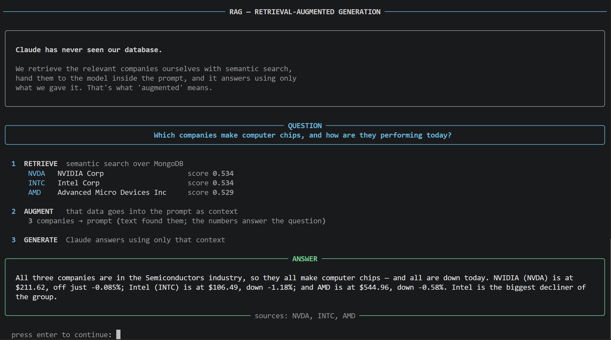

# Stock Market ETL Pipeline with Semantic Search & RAG 

A Python data pipeline that extracts live stock market data from a public API, stores it in MongoDB, serializes it to JSON, uploads it to AWS S3 — and lets you search the data by **meaning** rather than exact keywords.

```
Finnhub API  →  Python  →  MongoDB (EC2)  →  JSON Export  →  AWS S3
                              ↓
                        Semantic Search
```
## Demo

The whole project runs through one polished CLI:

```bash
python demo.py
```



*The menu-driven demo — pipeline, semantic search, and RAG, each runnable live.*

---
## Dataset

Live market data for twelve well-known technology companies (AAPL, MSFT, GOOGL, AMZN, NVDA, META, TSLA, NFLX, AMD, INTC, CRM, ORCL), pulled from the [Finnhub API](https://finnhub.io).

Each document combines two endpoints:

| Endpoint | Provides | Used for |
|---|---|---|
| `/quote` | price, day high/low, % change | numeric analysis |
| `/stock/profile2` | company name, industry, exchange, country | **text fields for semantic search** |

The text fields matter: they're what the semantic search layer embeds. Numbers have no semantic meaning — `$315.32` isn't *about* anything — which is why we chose company profiles over raw price data.

## Project Structure

```
.
├── main.py                # runs the ETL pipeline
├── embed_and_search.py    # generates embeddings + runs semantic search
├── src/
│   ├── config.py          # loads credentials from .env (nothing hard-coded)
│   ├── extract.py         # Finnhub API → Python
│   ├── load.py            # PyMongo CRUD (Create, Read, Update, Delete)
│   ├── export.py          # JSON serialization + integrity check
│   ├── upload.py          # Boto3 → S3
│   ├── embed.py           # text → vector embeddings
│   └── search.py          # semantic search (cosine similarity) + keyword search
├── tests/                 # pytest suite (16 tests)
├── .env.example           # template — copy to .env
└── requirements.txt
```

## Setup

**1. Clone and install**

```bash
git clone <repo-url>
cd stock-etl-pipeline
python -m venv venv
source venv/bin/activate        # Windows: venv\Scripts\activate
pip install -r requirements.txt
```

**2. Configure credentials**

```bash
cp .env.example .env
```

Then edit `.env`:

| Variable | Where to get it |
|---|---|
| `FINNHUB_API_KEY` | Free key from [finnhub.io/register](https://finnhub.io/register) |
| `MONGO_URI` | The EC2-hosted MongoDB connection string |
| `AWS_ACCESS_KEY_ID` / `AWS_SECRET_ACCESS_KEY` | AWS IAM credentials |
| `S3_BUCKET` / `S3_PREFIX` | The shared bucket and your team's folder within it |

> ⚠️ **`.env` is gitignored and must never be committed.** No credentials appear anywhere in the source — everything is loaded from environment variables.

**3. Run**

```bash
python main.py                          # the full ETL pipeline
python main.py --demo                   # pipeline + CRUD demonstration

python embed_and_search.py --embed      # generate embeddings (run once)
python embed_and_search.py --demo       # semantic search demo
python embed_and_search.py "your question here"

pytest -v                               # 16 tests
```

---

## The ETL Pipeline

**Extract** — calls Finnhub for each ticker, merging quote + profile into a single document. Rate-limited to stay inside the free tier (60 calls/min). A failing ticker is skipped and logged rather than killing the run.

**Load** — writes to MongoDB with PyMongo using **upsert** (keyed on `ticker`), so re-running the pipeline refreshes existing records instead of creating duplicates. With a shared team database, a plain insert would produce duplicates on every run.

**Export** — reads the data back from MongoDB and serializes it to JSON.

> **The ObjectId gotcha:** MongoDB adds an `_id` field of type `ObjectId` to every document, and `ObjectId` is not JSON-serializable — `json.dumps()` raises `TypeError`. We solve this with a custom `MongoJSONEncoder`. The export is then read back and row-counted to prove **data integrity was preserved**, and a test asserts the plain encoder fails without the fix.

**Upload** — pushes the JSON to S3 via Boto3, under the team's prefix. Timestamped filenames mean each run is traceable rather than overwriting the last.



## CRUD Operations

| Operation | Function | Description |
|---|---|---|
| **Create** | `upsert_companies()` | Bulk insert/update, keyed on ticker |
| **Read** | `find_all()`, `find_by_ticker()`, `find_by_industry()` | Retrieve all, one, or filtered |
| **Update** | `update_price()` | Targeted single-field update |
| **Delete** | `delete_by_ticker()`, `delete_all()` | Remove one or clear the collection |

Run `python main.py --demo` to see each execute in turn.

---

## Semantic Search

**Keyword search matches letters. Semantic search matches meaning.**

Search the database for *"chip makers"* with a normal keyword query and you get **nothing** — not one company contains the literal word "chip". But NVIDIA, AMD and Intel obviously make chips.

**How it works:**

1. **Embed** — each company's text (`name, industry, exchange, country`) is converted into a 384-dimension vector that captures its *meaning*. Things that mean similar things get similar numbers.
2. **Store** — the vector is saved back into the company's MongoDB document. No schema migration needed — one of the advantages of a document database.
3. **Search** — the query is embedded with the same model, then ranked against every company by **cosine similarity**. Closest vectors = closest meaning.



**Real result:**

```
QUERY: "electric car companies"

  KEYWORD SEARCH   ✗ No results
  SEMANTIC SEARCH  ✓ TSLA  Tesla Inc     0.606  ████████████
                   ✓ NVDA  NVIDIA Corp   0.381  ███████
                   ✓ AAPL  Apple Inc     0.362  ███████
```

Tesla scored a decisive **0.606**, matched purely on *"Automobiles"* in its profile — the model has never seen the words "electric" or "car" in Tesla's record, but understands they mean the same thing. The gap between 0.6 and 0.38 is the evidence it's working.

**Implementation notes:**

- **Model:** `all-MiniLM-L6-v2` via `sentence-transformers` — runs **locally**, so no API key, no cost, no rate limits, and it works offline once downloaded (~90MB, first run only).
- **Only text is embedded**, never prices or market caps — a test enforces this. Numbers carry no semantic meaning, so including them would only pollute the vectors.
- **Similarity is computed in Python**, not in MongoDB. Self-hosted MongoDB has no built-in vector search (that's a MongoDB Atlas feature). With twelve companies this is instant — and it means the actual similarity **scores** can be shown rather than hidden behind a black-box index.

**Next step:** RAG — feeding the retrieved companies to an LLM as context so it can answer questions in natural language rather than returning a ranked list.

## RAG — Retrieval-Augmented Generation

Semantic search *finds* the right companies. RAG makes an LLM *answer* using them.

1. **Retrieve** — semantic search pulls the relevant companies from MongoDB.
2. **Augment** — those companies are pasted into the prompt as context.
3. **Generate** — Claude reads that context and writes the answer.

**Claude never sees the database.** We retrieve the data ourselves and hand it over in the prompt — which is how you get an LLM to answer questions about private or real-time data it was never trained on. Both halves of the dataset finally work together: the **text** finds the companies, the **numbers** answer the question.



*Retrieve → Augment → Generate. The answer quotes real prices from the retrieved documents — and the grounding prompt means it says so plainly when data is missing, rather than inventing figures.*

The system prompt **grounds** the model against hallucination — it answers only from the supplied data. Answers are cached to `rag_cache.json` as an offline fallback.

---

## Error Handling

- **API:** timeouts, HTTP errors (including 403 free-tier limits and 429 rate limits), and malformed JSON are caught per-request — one bad ticker never kills the run.
- **MongoDB:** connection failures fail fast (5s timeout) with a message pointing at the likely cause (`.env` config or EC2 security group).
- **S3:** distinguishes missing credentials, access denied, and a non-existent bucket, so the fix is obvious from the message.
- **Config:** `validate_config()` fails at startup listing any missing variables, rather than crashing mid-pipeline.

## MongoDB on EC2

MongoDB is hosted on an EC2 instance (Ubuntu 24.04, MongoDB 8.0) so the whole team shares one database.

- Configured with `bindIp: 0.0.0.0` and **authentication enabled**.
- Port `27017` is open for the duration of the project so the team can connect from any network. **This is a deliberate demo tradeoff, not an oversight** — in production you would restrict the port to specific IPs or tunnel through SSH so the database is never internet-facing. The instance is terminated once the project is complete.

## Testing

```bash
pytest -v        # 16 tests
```

Covers JSON serialization (including proving the `ObjectId` fix is necessary), round-trip data integrity, the document structure the semantic search depends on, cosine similarity maths (identical / unrelated / opposite vectors, divide-by-zero safety), and that `build_text()` excludes numeric fields.

All tests run **without** a live database, API key, or the model downloaded — so they isolate "is my setup right?" from "are my credentials right?"

## Team Workflow

- Feature branches: `feat/`, `fix/`, `docs/`
- PRs into `main` rather than direct commits
- `.env` and `*.pem` are gitignored — **check `git status` before every commit**
